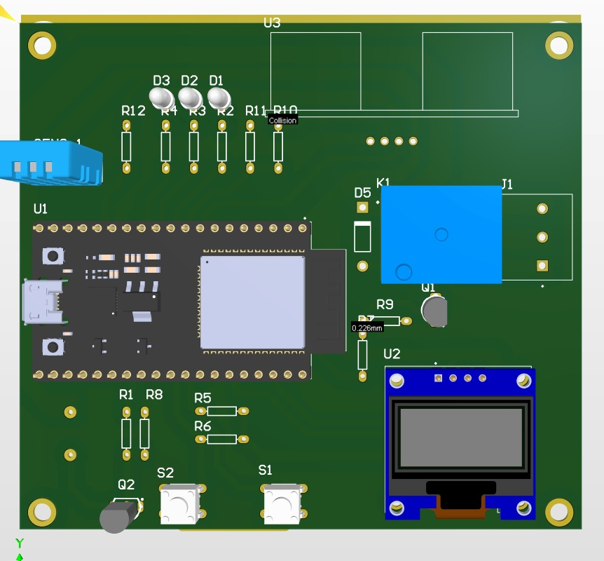
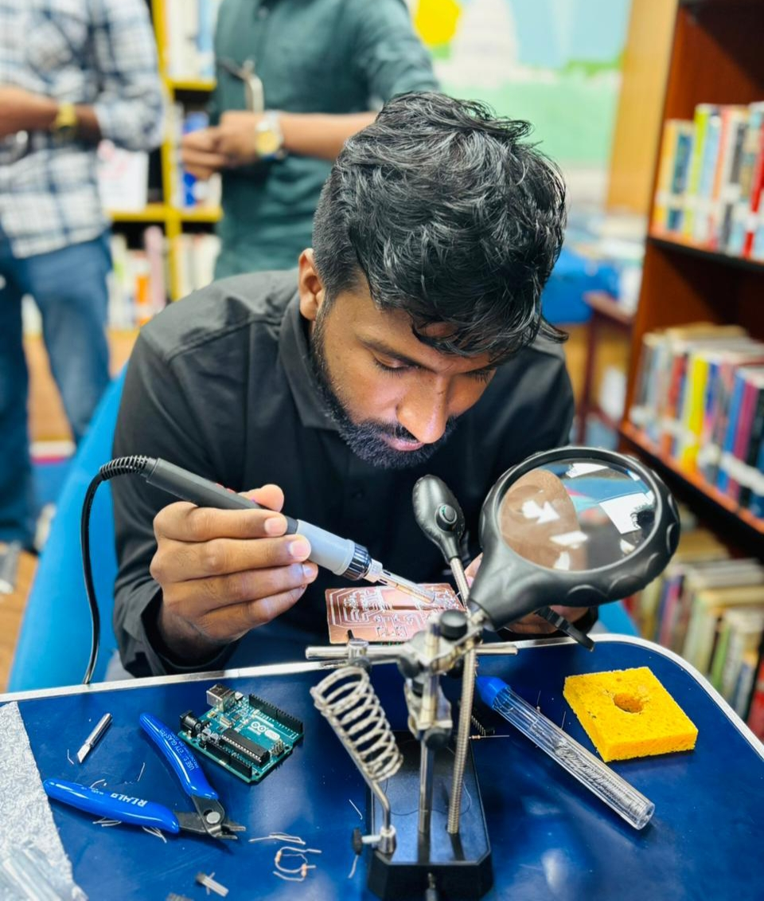
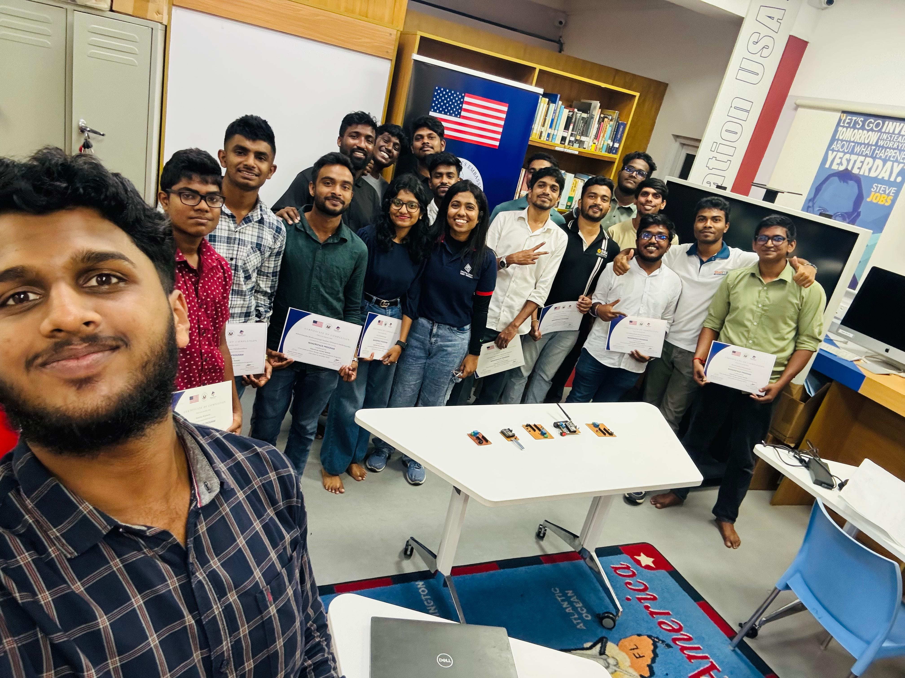

  

<h1 align="center">ESP32 Makerspace Monitoring Kit</h1>

  Ultrasonic Distance • DHT11 Temperature & Humidity • OLED Display

  <b>Educational Embedded System Project for American Corner Makerspace</b>

---

## 🔍 Overview
This project is an **ESP32-based educational monitoring system** developed for **American Corner Makerspace student workshops**.  
It demonstrates **real-time sensor interfacing** and **OLED visualization** using a beginner-friendly and expandable embedded design.

The system integrates:
- **Ultrasonic sensor** for distance measurement  
- **DHT11 sensor** for temperature and humidity monitoring  
- **SSD1306 OLED display (I2C)** for live data visualization  

---

## ✨ Features
- Real-time ultrasonic distance measurement  
- Temperature & humidity monitoring using DHT11  
- Live OLED display using I2C communication  
- Stable refresh with clear and readable UI  
- Beginner-friendly code structure  
- Designed for workshops, demos, and training sessions  

---

## 🧰 Hardware Components
- ESP32 DevKit  
- Ultrasonic Sensor (HC-SR04 or compatible)  
- DHT11 Temperature & Humidity Sensor  
- OLED Display (0.96″ SSD1306, I2C)  
- Breadboard and jumper wires  

---

## 🖥️ Software & Tools
- Arduino IDE  
- ESP32 Board Support Package  
- Libraries used:
  - DHT Sensor Library  
  - Adafruit GFX Library  
  - Adafruit SSD1306 Library  

---

## ⚙️ System Working
1. ESP32 triggers the ultrasonic sensor and calculates distance using echo timing  
2. DHT11 provides temperature and humidity data digitally  
3. ESP32 processes all sensor readings  
4. Data is displayed in real time on the OLED screen  
5. System updates smoothly for continuous monitoring  

---

## 🔌 Pin Configuration (Example)
| Component        | ESP32 GPIO |
|------------------|------------|
| DHT11 DATA       | GPIO 4     |
| Ultrasonic TRIG  | GPIO 5     |
| Ultrasonic ECHO  | GPIO 18*   |
| OLED SDA         | GPIO 21    |
| OLED SCL         | GPIO 22    |

> *Note: HC-SR04 ECHO pin outputs 5V. Use a voltage divider or logic level shifter before connecting to ESP32.*

---

## 🖼️ Project Images

### 🔹 Hardware Setup & Output

  
  

### 🔹 PCB Design

  

### 🔹 Workshop Activities

  
  
  

  <i>Soldering session, certificate awarding, and group photo from the makerspace workshop</i>

---

## 📂 Repository Structure
